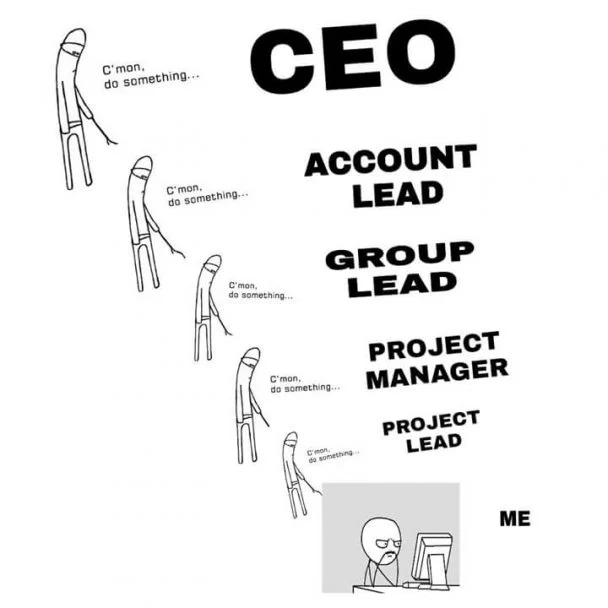

## The Most Difficult Part of Software Development

You can ask hundreds of software developers what the hardest part of software development is and you are likely to get 20+ unique answers. A novice might say the hardest part must be the coding part, it is very challenging to write software after all. For recent graduates, landing a job may be the hardest part. However, something that has been stressed over and over again in my software engineering class and what I've personally experienced is that managing a team to ensure an efficient workflow is without a doubt the hardest part of software development.

## Anyone Can Write Code

Writing code is so easy, even a robot can do it. Yes, we've reached a time in history where self-replicating code isn't some secret government technology or something hidden within a highly secured lab. And no, I'm not talking about Quines, AI can now replicate itself and pretty much everything from basic to intermediate code. What stops AI from gaining conscience and going terminator on us mortals? Well, besides needing energy that we humans produce, a complete conquest of humanity requires management and directives that can beat our hundreds of years of experience in war. There are two things fundamental to humans that AI sucks at: innovation and management.

## Project Management

