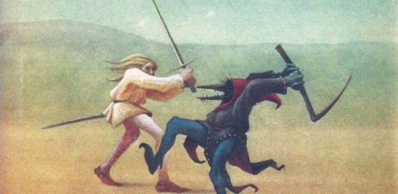

American Nightmare

“For many, the American dream has become a nightmare.” This statement by Bernie Sanders challenges the nature of the American Dream and begs the question of whether or not it’s still a dream accessible to the destitute or impoverished. The American Dream is a term used to enforce a sense of equality for everyone who aspires to be financially successful. We, as Americans, believe that race, financial status, age, etc are not factors in determining whether someone is able to garner success. Many have been driven by the dream and they have embodied it to rise to the highest rung even though the odds were stacked against them. However, in the modern age, where have all the dreamers gone? Have we thrown out the American Dream because it failed us or were we the ones who failed it?  I believe that we are the ones who failed the American Dream and it has been killed by fear. Our collective fear has made it nearly impossible for us or the future generations to live by the dream and become prosperous. We are now so resistant to change due to the risks involved with it and we, surprisingly enough, aren’t wrong for it. The financial climate of the modern day has lost the aspect of competition and attempting to compete with giant corporations seems like a nightmare to many. The dream is a traditional concept that the poor uphold and the rich benefit from.

According to Georges Abi-Heila of Medium, “Moving up the social ladder is a lottery and most of us lose.”(Abi-Heila) Unfortunately, the most important factors in determining who can access the American Dream are the ones that it hopes to abolish. Children born to penniless parents are never going to have the same opportunities as those who have been rich their entire lives. This alone is proven by our expectations for them and as a society, we determine someone’s success based on how much money their parents accrued. Unfortunately, the economic balance of America has gotten extremely skewed, the top 0.1% owns as many assets as the bottom 90%. In the same article Georges says “Inequalities are accepted as long as the possibility of betterment exists. We tolerate unfairness as long as there are good chances of improving our condition.”(Abi-Heila) This supports the fact that the poor can only hope to attain more financial stability than their parents. Why are the bottom 90% excluded from the luxuries reserved to the top 1% regardless of how hard they work for it? This imbalance extends to entire generations as the modern climate makes the hike to the top steeper and steeper. A video made by Peter Santenello details everything he dislikes about America. He explained what he thought of the media, politicians, fear, our collective lack of curiosity, our lack of purpose, entitlement, poor health care, free speech, cycles of poverty, sell outs, lack of compassion, and Covid. According to him, the media has gone down the toilet and it has sold out.(Santenello) Unfortunately, the media who should be serving the people is now acting as a huge disservice for our collective psyche and it’s more interested in monetary gains and polarizing people. This divide caused by the media and many other factors has caused everyone to be apathetic and avoidant towards each other. This matters in the American Dream since it is oftentimes not easily lived out by a single person. People rely on others to live the American Dream, yet media, fear, and politicians bring everyone apart. 

According to an article by Invincible Voices, “Young Americans today lack access to affordable education. Instead, we find ourselves straddled with massive amounts of student loan debt hanging over every decision we make.”(Invincible Voices) The author of this article has a Master’s degree however they can barely acquire an entry-level position or internship wherever she applies. This begs the question of where the education aspect of the American Dream lies. We’ve all grown up to believe that in order to actually get rich, or in other words live the American Dream, we must study hard and get outstanding grades, however in most cases, education is the smallest factor in success since it’s always been luck that has created giants. Another factor that’s suppressing the American Dream is the corporatism of America and rising costs for practically everything. Mark Thornton from Every Man Has a Story has given up on this dream and has moved to the Philippines in hopes of living an actually sustainable life. Mark says that America, nowadays, has become too corporal and the average person becomes a pawn of corporations; the American Dream has become too expensive.(Thornton) When people are forced to live paycheck to paycheck in order to support themselves and their family while subjected to the fear of sudden emergencies or accidents due to their financial volatility, do they really have time to dream? Do they even have time to sleep? This toxic work culture has poisoned our collective ability to dream of greater things. We lack ambition, curiosity, and purpose since we are too focused on survival. It’s ironic how many have moved away from the land of opportunity due to how expensive the cost of living is.

Many claim that the richest man in America and in the world, Elon Musk, was someone who worked for his ambitions and has carried out the American Dream. Make no mistake, however, this man is not a dreamer; he is the son of an extremely wealthy emerald mine owner. Throughout his entire life, he had a safety net - the one thing that many need just to dream. According to an article by Mike Trombetta from The Acronym, “With a rich family to borrow money from, and massive amounts of wealth gained from the exploitation of African mineral resources, Musk could finally purchase Tesla.”(Trombetta) This man does not embody the American Dream as all he had to do to accrue massive amounts of wealth was to pay his way up the corporate ladder by investing tons of money. He is more comparable to the Thomas Edison of our era than Nikola Tesla himself in the sense that he is a businessman before he is an innovator.

Once more, I believe that we are the ones who failed the American Dream and it has been killed by fear. The dream is a traditional concept that the poor uphold and the rich benefit from. The American Dream is, without a doubt, one of the most important concepts of American culture and history and it is comparable to documents such as the Constitution and the Declaration of Independence. It entails the fundamental principle of equality and America’s endless striving and grit. It calls us to never be complacent and to go against the odds with the comfort of knowing that we are as opportunistic as everyone else. I was particularly inspired by Peter who made a youtube video of him walking around on the streets while he discussed some of the issues of America. I agreed with most of what he said, but with his influence on his fanbase, he was able to express those concerns some people, including me, believe to exist in America today. The best thing one can do to try and live the dream once more is to not live in fear, spite, and blind obedience. The dream encourages us to throw out the fear of failure, to not treat others spitefully, and to be one’s own self without blindly obeying what corporations and media tell us.

Works Cited: 

Abi-Heila, Georges. “The American Dream Is Dead - Georges Abi-Heila.” Medium, 23 May 
2020, medium.com/@John.Val.John/the-american-dream-is-dead-fe9290dd0516.

Invincibles, Young. “Invincible Voices - The American Dream Is Dead.” Young Invincibles, 1 Apr. 
2021, younginvincibles.org/the-american-dream-is-dead.

Santenello, Peter. “What I Dislike About USA After 6 Years Living Abroad 🇺🇸.” YouTube, 31 
Jan. 2021, www.youtube.com/watch?v=XBwVy3-g4KM.

Thornton, Mark. “Why I Gave Up On The American Dream.” YouTube, 8 Mar. 2022, 
www.youtube.com/watch?v=v-Yqj2fHx6A.

Trombetta, Mike. “Elon Musk Is Not An Entrepreneur—He’s A Rich, Deceitful Hack – The 
Acronym | IMSA’s Official Student Newspaper.” The Acronym, 4 Mar. 2021, sites.imsa.edu/acronym/2021/03/04/elon-musk-is-not-an-entrepreneur-hes-a-rich-deceitful-hack.
