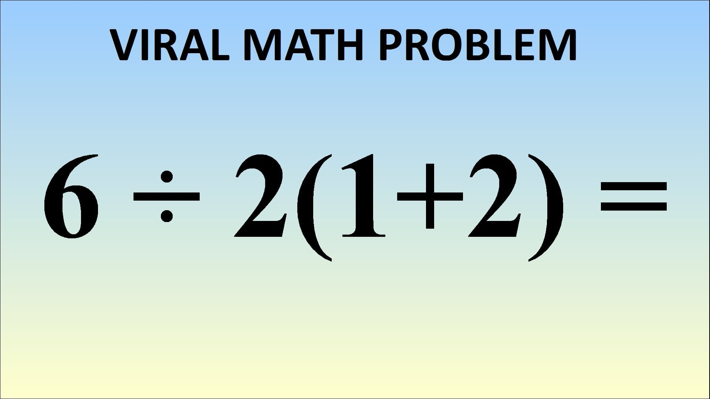

## We're all guilty of asking dumb questions.

Something worse than not being able to answer a question in class is not being able to think of a question in the first place. You put yourself in a very scary situation when you're so lost in a lecture that you can't even think of anything to ask. Whenever a professor asks if anyone has any questions and no one raises their hand, I wonder whether they think that it's because everyone understands the material perfectly or if they know that some people are just afraid of asking stupid questions. I myself am guilty of asking dumb questions, so are you, and so are some professors. Take this deceptive PEMDAS question for example.

You may think that this is trivial, but upon closer inspection, this is almost impossible without context.


## Smart Questions

There's this really cool website that you can use to determine whether your question is dumb or not, it's called Stack Overflow. If you ask a smart question, you get upvoted and people actually answer your question. Otherwise, may God have mercy on your soul because the only responses you're going to get are downvotes, links to similar questions that have been answered before, people calling your question dumb, and other mean things. But, smart questions in Stack Overflow often have a few properties that are common between them. Let's analyze the following question about processing arrays in C++.

[Link](https://stackoverflow.com/questions/11227809/why-is-processing-a-sorted-array-faster-than-processing-an-unsorted-array)
Before we even get to the question, the title already lays out everything we need to know about the nature of the question. Something I noticed whenever I make a post is that I like making the title vague to build some kind of tension and make viewers more intrigued, but this only really works for posts that are not meant to be queries. Unfortunately, a lot of users seem to make their titles too vague causing a lot of misunderstanding when people actually come to answer their questions.

```
Q:Why is processing a sorted array faster than processing an unsorted array?

In this C++ code, sorting the data (before the timed region) makes the primary loop ~6x faster:

#include <algorithm>
#include <ctime>
#include <iostream>

int main()
{
    // Generate data
    const unsigned arraySize = 32768;
    int data[arraySize];

    for (unsigned c = 0; c < arraySize; ++c)
        data[c] = std::rand() % 256;

    // !!! With this, the next loop runs faster.
    std::sort(data, data + arraySize);

    // Test
    clock_t start = clock();
    long long sum = 0;
    for (unsigned i = 0; i < 100000; ++i)
    {
        for (unsigned c = 0; c < arraySize; ++c)
        {   // Primary loop.
            if (data[c] >= 128)
                sum += data[c];
        }
    }

    double elapsedTime = static_cast<double>(clock()-start) / CLOCKS_PER_SEC;

    std::cout << elapsedTime << '\n';
    std::cout << "sum = " << sum << '\n';
}
Without std::sort(data, data + arraySize);, the code runs in 11.54 seconds.
With the sorted data, the code runs in 1.93 seconds.
(Sorting itself takes more time than this one pass over the array, so it's not actually worth doing if we needed to calculate this for an unknown array.)
```

As you can see, this question is formatted well enough that people decided that it is worthy of 27k upvotes and 25 answers. Likewise, the top answer has 35k upvotes and answers the question in sufficient detail. Analyzing the structure of his question, we can quickly observe that no other follow-up or unrelated questions are asked and the user only provides details of what exactly he meaant by his question. We see a fully-functional, replicable code as well as what he's tried and further conclusions. Another thing I've noticed based on my experience of asking questions in online forums is how people often never bother trying or experimenting with their system beforehand. People who respond to questions are quick to pick up on this and often ask whether you've tried doing this or that first before posting your question and 9 times out of 10, they haven't. So you should definitely try before you ask.

```
A: You are a victim of branch prediction fail.

What is Branch Prediction?

Consider a railroad junction:

Image showing a railroad junction Image by Mecanismo, via Wikimedia Commons. Used under the CC-By-SA 3.0 license.

Now for the sake of argument, suppose this is back in the 1800s - before long-distance or radio communication.

You are a blind operator of a junction and you hear a train coming. You have no idea which way it is supposed to go. You stop the train to ask the driver which direction they want. And then you set the switch appropriately.

Trains are heavy and have a lot of inertia, so they take forever to start up and slow down.

Is there a better way? You guess which direction the train will go!

If you guessed right, it continues on.
If you guessed wrong, the driver will stop, back up, and yell at you to flip the switch. Then it can restart down the other path.
If you guess right every time, the train will never have to stop.
If you guess wrong too often, the train will spend a lot of time stopping, backing up, and restarting.

Consider an if-statement: At the processor level, it is a branch instruction:

if(x >= 128) compiles into a jump-if-less-than processor instruction.

You are a processor and you see a branch. You have no idea which way it will go. What do you do? You halt execution and wait until the previous instructions are complete. Then you continue down the correct path.

Modern processors are complicated and have long pipelines. This means they take forever to "warm up" and "slow down".

Is there a better way? You guess which direction the branch will go!

If you guessed right, you continue executing.
If you guessed wrong, you need to flush the pipeline and roll back to the branch. Then you can restart down the other path.
If you guess right every time, the execution will never have to stop.
If you guess wrong too often, you spend a lot of time stalling, rolling back, and restarting.

This is branch prediction. I admit it's not the best analogy since the train could just signal the direction with a flag. But in computers, the processor doesn't know which direction a branch will go until the last moment.

How would you strategically guess to minimize the number of times that the train must back up and go down the other path? You look at the past history! If the train goes left 99% of the time, then you guess left. If it alternates, then you alternate your guesses. If it goes one way every three times, you guess the same...

In other words, you try to identify a pattern and follow it. This is more or less how branch predictors work.

Most applications have well-behaved branches. Therefore, modern branch predictors will typically achieve >90% hit rates. But when faced with unpredictable branches with no recognizable patterns, branch predictors are virtually useless.

Further reading: "Branch predictor" article on Wikipedia.

```
 
## Dumb and Dumber

While there are decent questions that benefit everyone, there are those one can ask to create an entirely different effect. In the following example, a user asks how he would, in short, create a desktop application with Facebook.

```
Q: Facebook Desktop Notifier

I am a beginner programmer that have never used anything other than what's included in a language.

I am trying to create a desktop application that notifies me anytime I get an update onfacebook. 
How should go about doing this? Thanks in advance.

edit Sorry I was not clear. Is there any way to make a DESKTOP application with facebook?
```

A simple “yes” would have answered the question, but we know that’s not the sort of answer he or she is looking for. Fortunately, someone kindly responded with a link to Facebook’s developer website. The asker should have done more research on his or her potential project. Then further down the road, he or she could have asked more specific and detailed questions that wouldn’t require a thousand-paged response for a sufficient answer.

## Conclusion

When we rely on others’ generosity and expertise to provide answers to our questions, it should hold that the question we ask should be one that leads to efficient and effective help that not only benefits us, but also the people we ask and others who might ask the same question in the future. Thus, if you have a question… make it a smart one! Asking questions may not always get you the best answer, but asking them in a way that will make others want to answer them will increase the success of finding a good solution and make it a positive experience on all sides.
