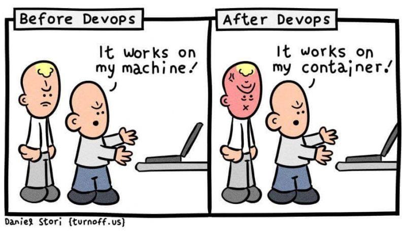

 

## "But-but It Works On My Machine!"

Few things in the world of software tick me off more than the phrase "But it works no my machine." I've heard it so many times to the extent that I just had to default my responses to a cranky "wow, mind donating your pc to me then?" A really important reality in software development that isn't fully acknowledged in most classes is the collaboration part. This is something that I myself did not realize prior to taking ICS 311 and ICS 314. This often obfuscated reality is evident in amateur programmers and people starting out in software development or even computer science as a whole. Oftentimes, a blind spot comes up whenever the idea of the finished product takes precedence over the process of actually finishing that product. This does not only cause developers to become too ambitious, it also often causes a general disregard for healthy team dynamics. Members get left behind for working too slow or even cut off because the same software works for the other half of the team. Think about it, if your own team can't even make the software work for every member, would it even stand any chance when deployed in the real world with potentially millions of clients? But, how exactly do we make the process of collaboration more streamlined? Thankfully, in our ICS 314 class, we can simply go to Cam Moore's GitHub and click on the little grey box that says "Use this template" beside the NextJS repo we're trying to use. This is where software design patterns come in; we use these templates and pre-made designs and simply tweak them to work for our own application. I can't even begin to imagine what ICS 314 would've been like had we been required to do our own installations and create our own NextJS applications without the templates. By having the templates made for us, I believe that we were able to kill two birds with one stone. First, like I mentioned, it puts everyone on the same page much faster, so every person in class was guaranteed to be able to run their software given that they did everything in the documentation correctly. This allows every member to collaborate more efficiently without having to say "it works on my machine." Second, no one would've been able to help anyone in class if they didn't even know what kind of files the other person had. I believe that I was able to help a lot of people in class through both private messages and the smart questions channel in Discord thanks in large part to the fact that I likely knew what they have installed and that I've had the same issue they were having.

 

## In the Lenses of a Solo Developer

Something that I only noticed after writing an entire paragraph on design patterns is that I'm literally using one right now. This markdown file is based on a template of a previous essay I had to make. With this realization, I've also come up with even more pros to using design patterns. The first is that if I were being completely honest, I wouldn't have known how to format the header for this file. It's been two months since I've written an essay on my GitHub page, so I've already forgotten how to format these markdown files. If I was working blind without a template, it would've taken me about as long as half the time I've spent writing this essay in just figuring out what I should put at the top of the file to format it. And, as we've been told again and again in class, excess time spent in developing software could cost a lot of money. Second, even more time is saved because I didn't have to relearn what I needed to do to edit the tags or the title and the date of this page because I've already done it before using the same template. Third, this doesn't only apply to markdown files, even for individual projects, we had to use our implementation of Island Snow to create Murphy's Bar and Grill and then use our implementation of Murphy's Bar and Grill to create Kohana Rum. It's an endless cycle of making newer and better things using templates.

 

## Design Patterns at an Enterprise Scale

For large-scale applications, software design patterns stop resembling shortcuts and start becoming requirements. The be-all and end-all determinant of an organization's success is communication and collaboration. This is something that we have been taught prior to beginning our final software project. Prior to this, we've only ever had one or two other members in our small-scale software projects. While we definitely used software design patterns then, to me, they honestly seemed to be there for the sake of formality (and, of course, better teamwork dynamics later on in the course.) I noticed that in these smaller teams, we could've sometimes gone without the need for the templates given to us. Now that we're actually doing the final project, making sure that everyone is on the same page is made infinitely easier by the templates. Knowing this, it's easy to see how the same principle would apply to corporations like the ones in FAANG, startups, and more. Another concept that's been repeatedly mentioned in class is do not reinvent the wheel. If an automobile company forced all its factory workers to reinvent the wheel prior to working on the automobile itself, it wouldn't only be a very bad automobile company, it wouldn't even be an automobile company at all; it'd be a wheel company. Likewise, if we forced everyone to figure out how to install and create our own templates before getting started on NextJS or React, we'd be very familiar with those two frameworks at the cost of developing any real software development skills. If you've read [my essay on UI Frameworks](https://ralph-uy-aes.github.io/essays/strap-your-boots-were-going-to-framework.html), you can see how mastering two specific frameworks isn't very practical.