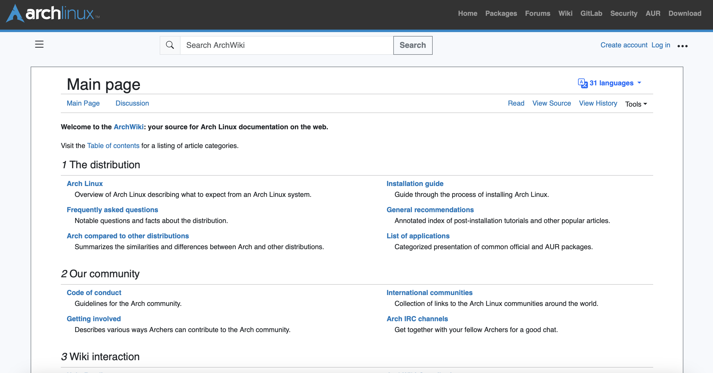

 

## From the Perspective of an HTML/CSS Purist

Looking at the work of art on the left, we observe a man jaded, terrified even, by all the crazy UI frameworks invading his private domicile. He exclaims "I HATE FRAMEWORKS I HATE FRAMEWORKS I WANT PLAIN HTML/CSS/JS AND PHP BACK". Humor aside, the existence of this image raises the question of why is it that in a world with UI frameworks that claim to streamline the creation of and even visually improve websites, some developers still resist and opt to stay true to raw HTML and CSS? To start with the obvious, HTML and CSS are extremely simple as markup languages. Often, we find it easier to stick with what we know and what is simple, however simplicity fosters complacency. In the case of using a tool as basic as a hammer, a lot can be accomplished: you can use it to hunt for food, to drive nails into various objects, and even to climb. However when it is faced with a something like a screw it struggles to uphold its efficiency. So, we find another tool: a screwdriver. It can be used for most of the same things that a hammer can do, but now we have the added functionality of being able to efficiently drive a screw in and out. Do we throw the hammer away because we found a better tool? Usually, no. In the same way, using HTML and CSS is sufficient for a lot of things and you can even possibly build a career out of it. However, in order to solve problems more efficiently, a different tool is required. An HTML/CSS purist challenges the promised improvement of UI frameworks by asking whether they are even worth the struggle to begin with.

 

## From the Perspective of a UI Framework Junkie

In the same image, we observe a couple of really scary men surrounded by UI frameworks. They resemble zombies that desperately want to infect you (or eat you). An HTML/CSS Purist fears and resist UI frameworks, whereas a UI framework junkie welcomes them with open arms, maybe too open. While I was looking for references for this essay, I found a weird stigma about JS developers jumping vehemently between various frameworks like my mom going back and forth between various Costco samples. To me, it seems as though people who are on this side of the fence love experimenting with new frameworks. I find this comparable to people who collect tools that they're only ever going to use once and then store in their garage. Someone who uses a lot of different frameworks will obviously find it easier to adapt their solution to different problems compared to someone who just prefers raw HTML and CSS. I believe that this is one of the main benefits of using UI frameworks.

 

## My Experience with Bootstrap 5

Finally, I get to talk about my own experience instead of memes. My experience with Bootstrap 5 felt like I was on a rollercoaster. Not in the sense that it was exhilarating, very far from it actually (it was very boring and tedious). I was going back and forth between liking and disliking Bootstrap 5 because at some points I would think that just using pure CSS for margins and stuff like that would be so much easier, but I stayed true to the Bootstrap method of adding margins to class. But, I also liked Bootstrap whenever I had to make more complex UI elements such as navigation bars, dropdowns, containers, and even grids. I remember thinking to myself that doing this with just HTML and CSS would be a massive pain in the butt. Another thing I particularly liked was being able to change various properties of elements just by appending some syntax to the class. Although it might seem confusing at first, I found this really helpful when I was recreating the ArchWiki. Instead of having to go back and forth between style.css and index.html, I just had to change mt or me or ms or pb or whatever it was. Finally, the best thing about Bootstrap 5 for me was how easy it was to install. I just had to get a couple of scripts and suddenly, I got new elements that streamlined the UI creation. As I was editing this markdown file, I noticed that the img elements used Bootstrap 5 because the class pe-4 and float-start. On the left is my recreation of the ArchWiki which turned out better than I thought it would. Various Bootstrap elements were used such as the navbar on the top, grids for the sub text below each heading, dropdowns for the translate, context menu, etc..., and buttons for some dropdowns. Overall, I enjoyed using Bootstrap 5 and I believe that it enhanced my experience with web design.