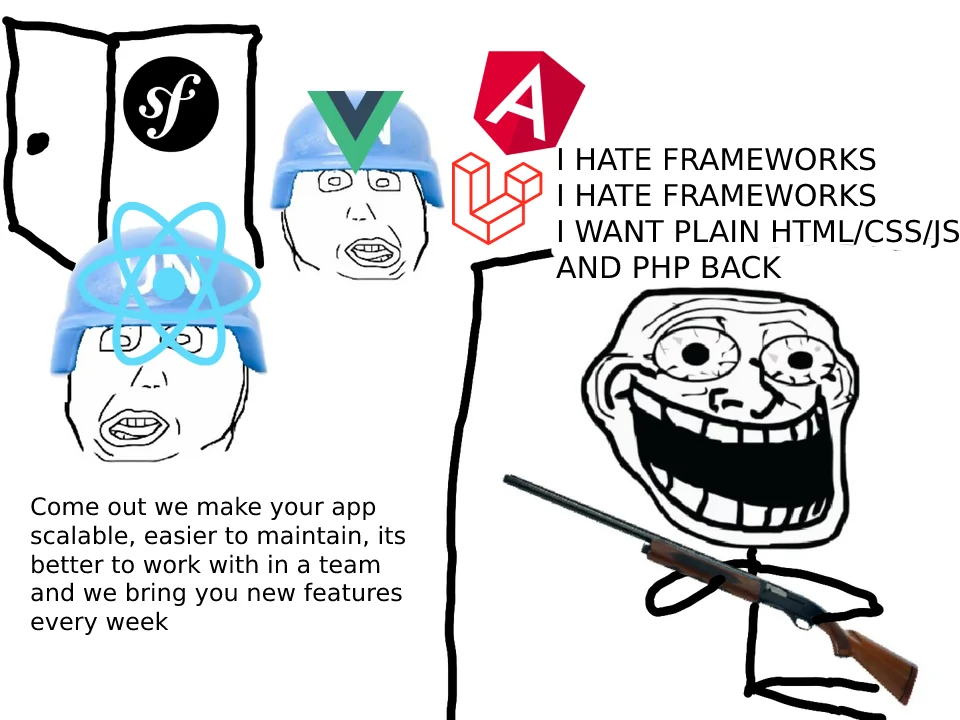
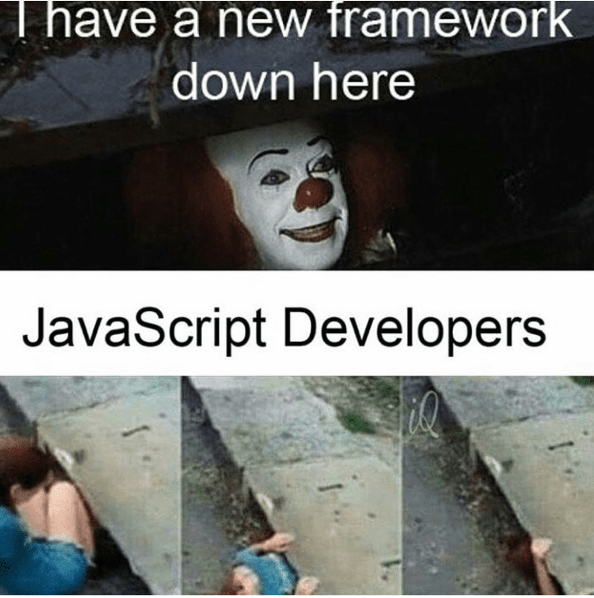

 

## From the Perspective of an HTML/CSS Purist

Looking at the work of art on the left, we observe a man jaded, terrified even, by all the crazy UI frameworks invading his private domicile. He exclaims "I HATE FRAMEWORKS I HATE FRAMEWORKS I WANT PLAIN HTML/CSS/JS AND PHP BACK". Humor aside, the existence of this image raises the question of why is it that in a world with UI frameworks that claim to streamline the creation of and even visually improve websites, some developers still resist and opt to stay true to raw HTML and CSS? To start with the obvious, HTML and CSS are extremely simple as markup languages. Often, we find it easier to stick with what we know and what is simple, however simplicity fosters complacency. In the case of using a tool as basic as a hammer, a lot can be accomplished: you can use it to hunt for food, to drive nails into various objects, and even to climb. However when it is faced with a something like a screw it struggles to uphold its efficiency. So, we find another tool: a screwdriver. It can be used for most of the same things that a hammer can do, but now we have the added functionality of being able to efficiently drive a screw in and out. Do we throw the hammer away because we found a better tool? Usually, no. In the same way, using HTML and CSS is sufficient for a lot of things and you can even possibly build a career out of it. However, in order to solve problems more efficiently, a different tool is required. An HTML/CSS purist challenges the promised improvement of UI frameworks by asking whether they are even worth the struggle to begin with.

 

## From the Perspective of a UI Framework Junkie

In the same image, we observe a couple of really scary men surrounded by UI frameworks. They resemble zombies that desperately want to infect you (or eat you). An HTML/CSS Purist fears and resist UI frameworks, whereas a UI framework junkie welcomes them with open arms, maybe too open. While I was looking for references for this essay, I found a weird stigma about JS developers jumping vehemently between various frameworks like my mom going back and forth between various Costco samples. To me, it seems as though people who are on this side of the fence love experimenting with new frameworks. I find this comparable to people who collect tools that they're only ever going to use once and then store in their garage. Someone who uses a lot of different frameworks will obviously find it easier to adapt their solution to different problems compared to someone who just prefers raw HTML and CSS. I believe that this is one of the main benefits of using UI frameworks.

## Bootstrap 5

## Getting Meta

If you think about it, everything technically has standards. However, if I were to make one exception, I think art is the single thing that frees itself from standards. Art is a form of self-expression and it lends itself to many different personal interpretations. Likewise, if you were to take a piece from one artist and compare it to anothers you'd almost immediately notice that their styles differ greatly. 