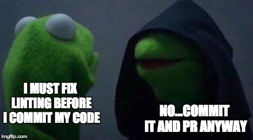
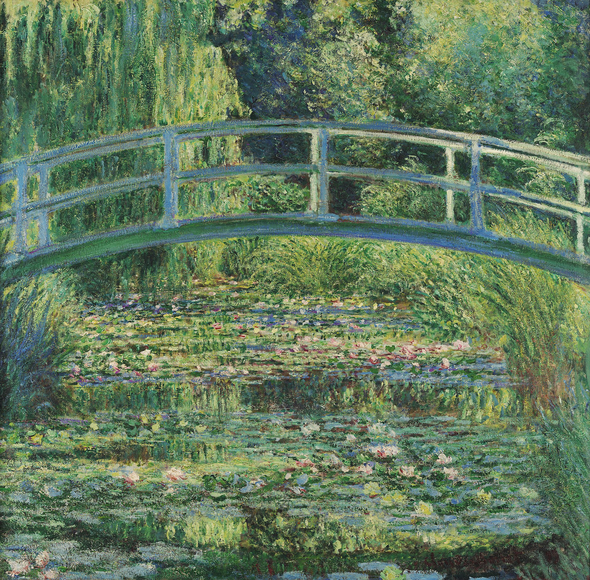

 

## Everything Has Standards

If you think about it, everything technically has standards. However, if I were to make one exception, I think art is the single thing that frees itself from standards. Art is a form of self-expression and it lends itself to many different personal interpretations. Likewise, if you were to take a piece from one artist and compare it to anothers you'd almost immediately notice that their styles differ greatly. Take for example, a painting by Monet: Water Lilies and Japanese Bridge. 

 

I remember seeing this painting for the first time and the depiction of the water struck me. I asked myself how any viewer would look at it and confidently say "yep, that sure is a pond!" Now, take a painting by another artist, Munch: The Scream            

 

If we ignore the person screaming in the foreground, we notice what seems to be a small gulf or some body of water in the background. But how do we interpret it to be water? There was no standard between these two paintings that established that water must look a certain way. Actually, Monet and Munch don't even use the same styles here. Monet used Impressionism which is a method that captures light and scenery using brighter colors whereas Munch used Expressionism which is a method that captures the internal turmoil or emotions of the artist by using intense colors and distortion. Yet, somehow we are able to interpret the bodies of water in the paintings exactly as their respective artists intended them to be at face value.         

## Coding Standards

Anyway, now that we're done with all that filler content... (just kidding it ties into coding standards). Can we interpret programming to be art? Can a piece of code be printed, framed, and hung up for others to appreciate its elegance? Maybe. But then wouldn't that have the implication that, as a piece of art, a piece of code need not abide by standards? What even is an elegant piece of code anyway? Is it code that follows ESLint standards to a T? If it is, then call me the Van Gogh of Typescript. No, I think that code can be elegant in its simplicity, design, and even history. Perhaps some chatbot I made for discord 7 years ago that barely worked isn't elegant in a senior dev's eyes, but for me its story entails friendship, trust, and collaboration. It is elegant to me. The interpretation of code as art is, much like paintings, often sourced from individual works. A controversial figure and legend on the internet is Terry A. Davis. His creation of HolyC and TempleOS as an indie developer with mental afflictions is nothing short of genius. If any developer has come close to creating true art in the form of code, I'd argue that it would have been him.      

## Standards Are a Social Construct

Obviously, collaboration between artists is not something unheard of. Take Basquiat and Warhol for example; they were a dynamic duo. Likewise, collaboration in code is getting more and more prevalent, whether I like it or not (I'm on the fence). Google, Facebook, and other major pieces of software would have been impossible without the collaborative effort of a group of individuals. As this group gets bigger and bigger, more and more interpretations come together and clash. Is it opening curly brace immediately after function declaration or is it new line before opening curly brace? Let's make up statistics! Suppose 75% of developers prefer the former. So, 25% of developers like putting a newline before the opening curly brace. In a group of four that's only one person! Who cares what they think right? But for a group of 100 developers, that's like 25 people. Things can get out of hand pretty fast.      

## To Lint or Not To Lint

Personally, I do believe that standards are important for collaborating between a group of developers. It's easier to enforce rules in style than debate which is better or figure out what the other person wrote. It is perhaps also more cost-effective in terms of time spent. However, for projects that are meant to be solo, I think that standards should be optional. What I mean by this is that code could be interpreted as art. Whatever unique element a programmer puts into their code should not be altered by a set of standards. Standards don't make things look prettier because pretty is ultimately subjective, they do, however, make collaboration more streamlined. Obviously, for solo developers planning on releasing code to be open source and allowing people to tweak it to their liking, perhaps standards can be followed, after all, you're still unknowingly collaborating.