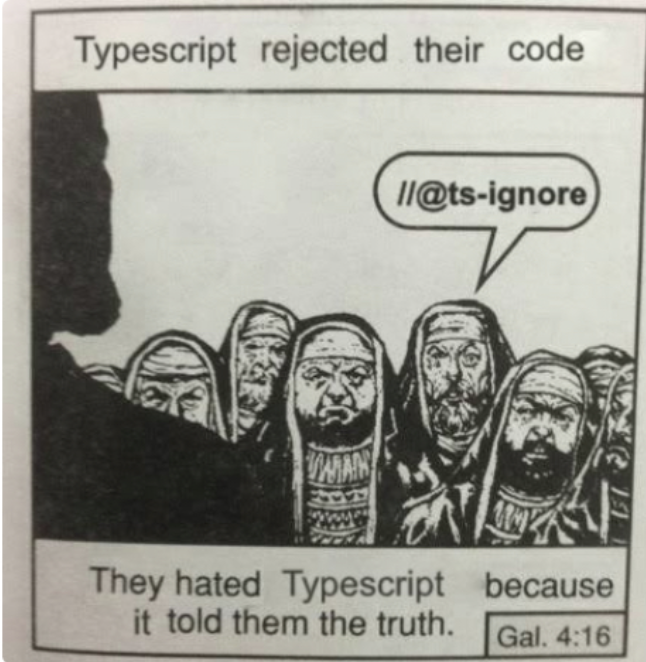

## Why are the datatypes there?
For someone who came from a programming background that emphasizes highly strict datatype requirements, Typescript seems like a fever dream. It's funny because until now, having done all the tutorials and a couple WODs, I still put "int i = 0" in loops instead of "let i = 0". In Typescript, you can (but you don't have to) specify the data using a colon after the let statement and the name of the variable. This seems really counterintuitive in my opinion because older languages such as C do this by simply letting you type in every specifier before the variable name. Think "const int i = 0;" instead of "let i : number = 0;". I feel like mixing things up in this way makes it a little more confusing to format and it almost seems like a case of "if it ain't broke, don't fix it."

## Creating Functions
Something that has surprised me in Typescript is how you can make functions in at least 3 different ways. There are two common notations: the regular one and the arrow form. While there's nothing wrong with having options, I feel like the addition of arrow functions sort of makes this language a lot more complex to learn from the beginning. Instead of letting beginners get the hang of regular function notation, Typescript causes you to always keep that other notation in the back of your head waiting for an opportunity to use it. As an indecisive person, this only makes me split my attention between the two different methods instead of focusing and mastering one.

## Typescript as a Natural Language
Like natural languages, Typescript has revealed to me that there is always more than one way to write even the simplest bit of code. This is obviously evident in other programming languages, however Typescript's different notations highlighted this for me. I always kept thinking of how I could write different lines of code to get the same result. I am also taking Chinese Mandarin as a second language and it surprises me how I could make connections rather easily between a natural and a computer language. Much like in other languages and Typescript, Mandarin lets you use different forms of sentence structure to achieve the same goal. Something like "如果" and "要是" both mean "if". I find this similar to Typescript's use of different notations.

## Typescript in Software Engineering
I am excited to learn more about Typescript because I believe that it had just been a rough start. It seems that a lot of professional developers actually like Typescript a lot, so I believe that I too can enjoy it. One striking thing that concept in Typescript me tinkering in class was the idea that you could pass functions as arguments. The implication of functions being first-class citizens in Typescript caused me to try doing it in class for the temperatureConverter function. I was successful in this, but I wonder how you could solve the error of undefined functions.

## Athletic Programming
I like the idea of writing lots of code because I believe that it trains us to learn the intricacies of the language. Even if the problems aren't insanely difficult, just taking the time to sit down and experiment with the language gives us the opportunity to actually apply the theory that we've learned. Programming is similar to weightlifting because sitting around all day without working out causes your muscles to get weaker. If the muscles do not experience resistance, no growth is achieved. Likewise, if you only do a little bit of programming, you shouldn't expect much progress.
