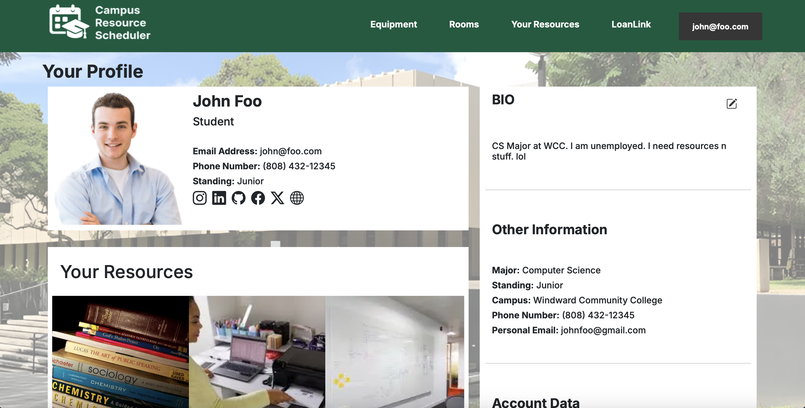
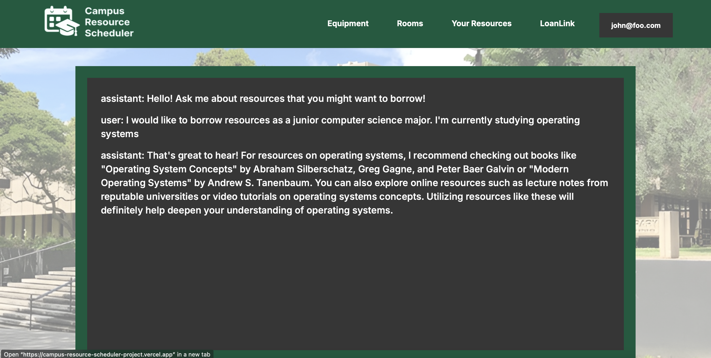
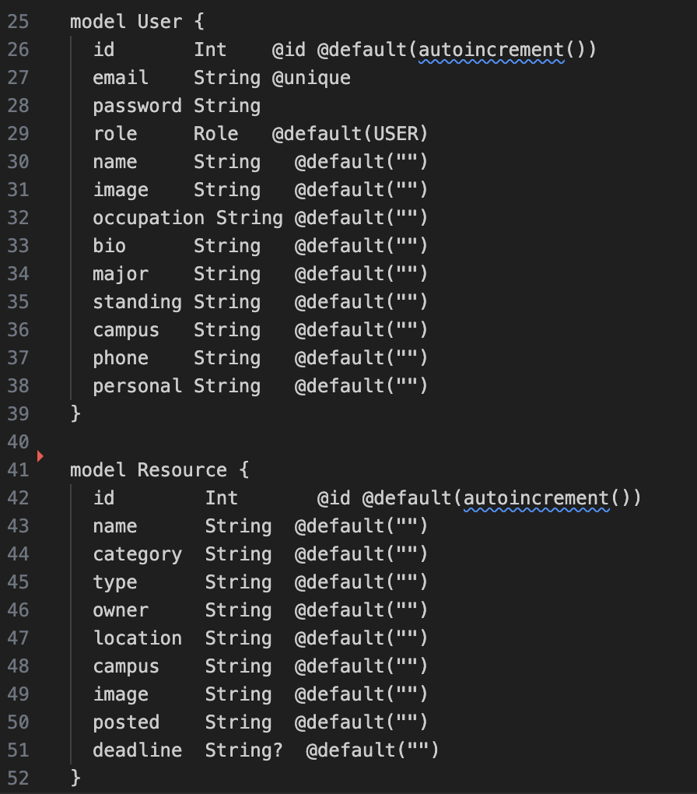
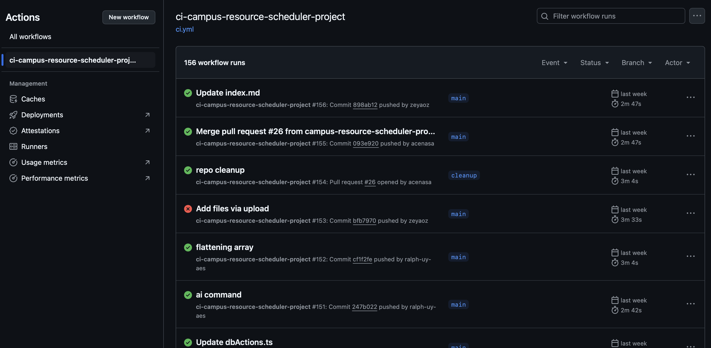
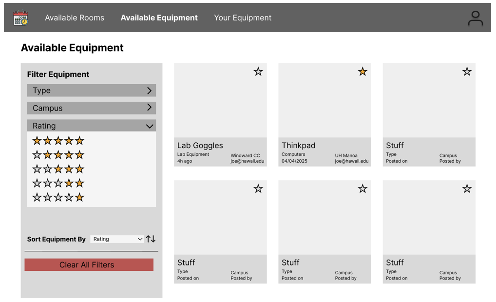

## Brief Overview

I had the pleasure of working with four other students (Zeyao Zhou, Sungwon Han, Arthur Acenas, Eric Chae) for our final project in ICS 314: Software Engineering. The campus resource scheduler was designed with over 20,000 students in mind. We wanted to improve the efficiency and ease of borrowing and lending campus resources within the university. This process has been notoriously time-consuming and not worth the effort as many students had to navigate through outdated GUIs and processes to borrow campus resources. Furthermore, we implemented an AI chatbot to encourage students to borrow resources.

## My Contributions

I actually had a lot of different roles in this project. I was in charge of creating our page mockups, designing our schema for our database, creating our profile page and landing page, creating our AI chatbot, writing our Playwright tests, and a lot of other minor roles. I definitely felt as though I directed most of our technical decisions as a group such as whether we needed to restart the database or the project, how our website should look like in terms of the themes and general aesthetic, what types of data our User and Resource objects would have, and how we would handle deployment and database errors.

### 1. Landing Page

This was

  

This was

### 2. Profile Page

  

### 3. Chatbot

  

### 4. Prisma Schema

  

### 5. Playwright Testing

  

### 6. Mockup Pages

  

## What I Learned

## Links

Link to [Documentation](https://campus-resource-scheduler-project.github.io)

Link to [Github Project](https://github.com/campus-resource-scheduler-project)

Link to [Deployed App](https://campus-resource-scheduler-project.vercel.app/loanlink)