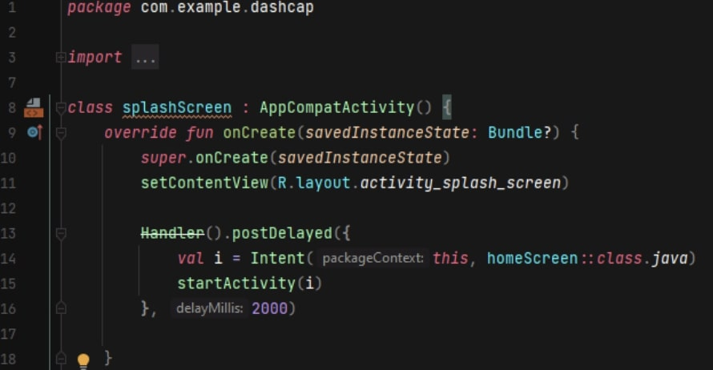
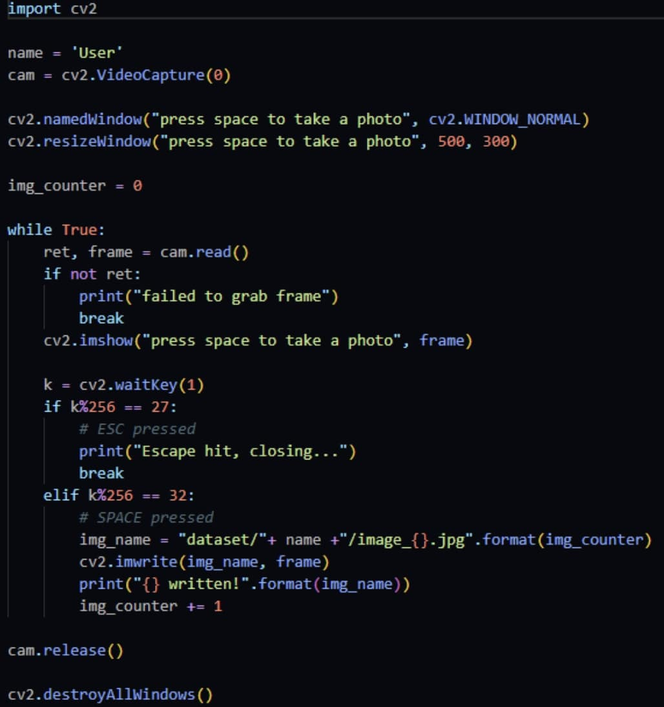
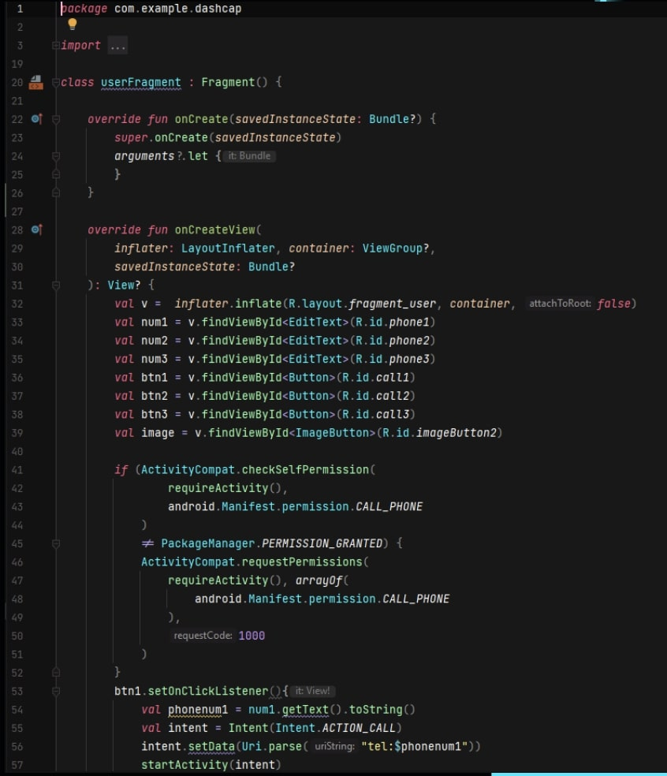

  

DashCap was a science fair project primarily developed by me as well as another colleague who thought of the idea of the project. The project was designed to facilitate a secure space around people who may feel unsafe walking around public spaces due to the threat of malicious individuals. It is a wearable device that is designed to have small cameras around the cap so that it is constantly recognizing faces around the vicinity of an individual. The facial recognition aspect of the device uses AI to match faces with registered sex offenders and criminals from mugshots within police databases. If these individuals are detected, a notification is sent to your phone from the DashCap app. This app features multiple emergency features such as a map that leads you to the nearest police station, emergency contacts on speed dial, and a view of each camera to avoid directly alerting and interacting with potential perpetrators.

For this project, I pretty much built the entire thing except for the AI part. I built the app from scratch using Android Studio and Kotlin, Firebase for the police records, and a Google Maps API. I also designed and implemented the hardware for the device itself. We used an Arduino Micro with a camera module for prototyping. The Arduino Module contained the AI for facial recognition and it had around a 96% accuracy even in dark environments. The AI was developed by my partner, and I improved on it with small tweaks.

This project was presented in the Windward District Science Fair, Hawaii State Science Fair, and University of Hawaii at Manoa College of Engineering Banquet. It won Best in Category: Systems Software at the District level, and the UHM CoE HSSEF SR Project Winner Award of $300 at the State level. It also won us a few other textbooks and stuff for free.

Here is some source code...

  
  
  
  

## Tech Stack
- Kotlin 🟪
- Firebase 🔥
- Raspberry Pi 🍓
- Android Studio 💚
- OpenCV 👾
- face_recognition 😶‍🌫️

## Links

- Link to [Slides](https://docs.google.com/presentation/d/1zbPpv_gK2V0kT8allo0QWK3V9DzuUiySDSKHdsRcRtw/edit?usp=sharing)
- Link to [Github Repository](https://github.com/ralph-uy-aes/dashcap)