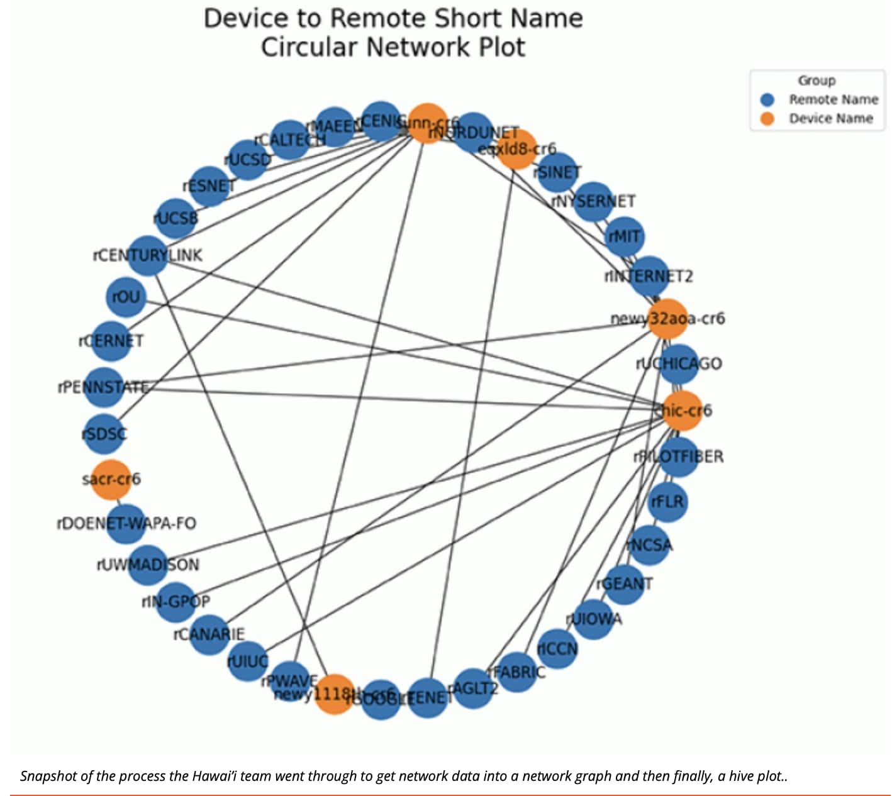

  

My first internship experience was at Lawrence Berkeley National Laboratory. I was in a group of three under the CD06 project. We were tasked to create new methods for visualizing data for network traffic. We were given ESnet's raw network trafficd data and were trained to create new methods of data visualization. We ended up creating three different methods for ESnet.

For this project, I worked on two of the three visualizations our group had. I had some help from the other members too. This experience taught me how to work with other people in a professional environment and what it's like to be in a real tech work setting.

This project introduced data visualization to me. I have never really been big on charts and graphs because I typically like things formatted in clear easy to read text, but with the information we were working with, this was simply not possible. I learned of how basic programming can easily improve work flow by making information easier to digest using visuals. Furthermore, data visualization can be applied to machine learning, and by extent artificial intelligence. I was able to use a lot of what I learned in this internship experience in my machine learning class.

For more information and my feature on Berkeley's site: https://www.es.net/news-and-publications/esnet-news/2023/esnets-einr-summer-interns/

Some more images...

  
  
  

